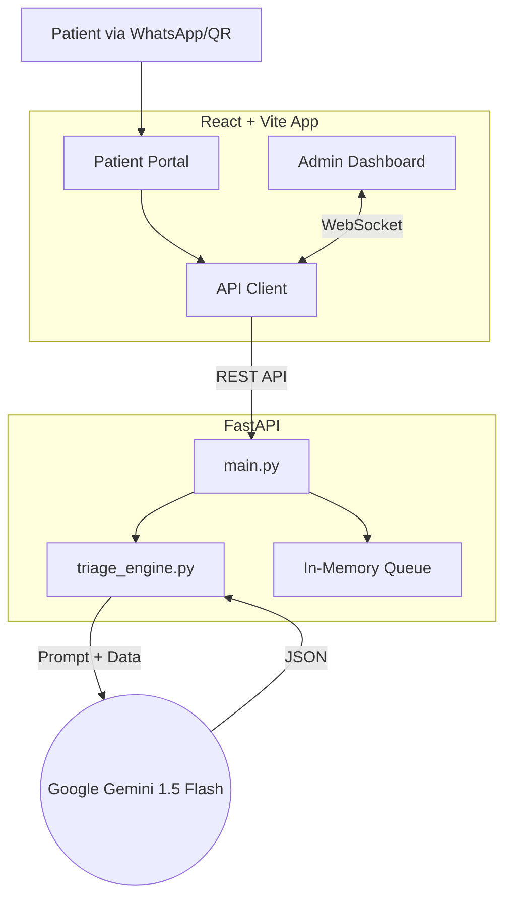
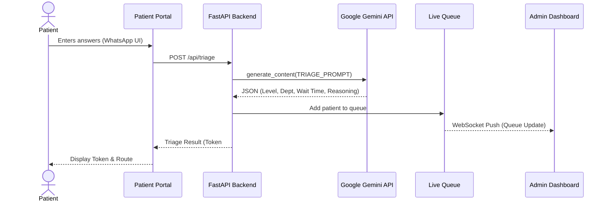
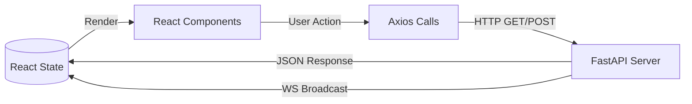

# System Architecture

```mermaid
flowchart TD
    Patient[Patient via WhatsApp/QR] --> Frontend
    
    subgraph Saarthi Frontend [React + Vite App]
        Frontend[Patient Portal] --> API[API Client]
        Admin[Admin Dashboard] <--> |WebSocket| API
    end
    
    API --> |REST API| Backend
    
    subgraph Saarthi Backend [FastAPI]
        Backend[main.py] --> TriageEngine[triage_engine.py]
        Backend --> QueueManager[In-Memory Queue]
    end
    
    TriageEngine --> |Prompt + Data| Gemini((Google Gemini 1.5 Flash))
    Gemini --> |JSON| TriageEngine
```

# Patient Triage Sequence

```mermaid
sequenceDiagram
    actor Patient
    participant Portal as Patient Portal
    participant API as FastAPI Backend
    participant Gemini as Google Gemini API
    participant Queue as Live Queue
    participant Admin as Admin Dashboard

    Patient->>Portal: Enters answers (WhatsApp UI)
    Portal->>API: POST /api/triage
    API->>Gemini: generate_content(TRIAGE_PROMPT)
    Gemini-->>API: JSON (Level, Dept, Wait Time, Reasoning)
    API->>Queue: Add patient to queue
    Queue-->>Admin: WebSocket Push (Queue Update)
    API-->>Portal: Triage Result (Token #)
    Portal-->>Patient: Display Token & Route
```

# Data Flow Diagram

```mermaid
flowchart LR
    State[(React State)] --> |Render| UI[React Components]
    UI --> |User Action| API[Axios Calls]
    API --> |HTTP GET/POST| Server[FastAPI Server]
    Server --> |JSON Response| State
    Server --> |WS Broadcast| State
```
