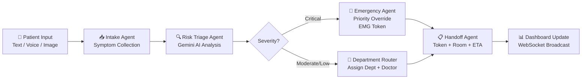
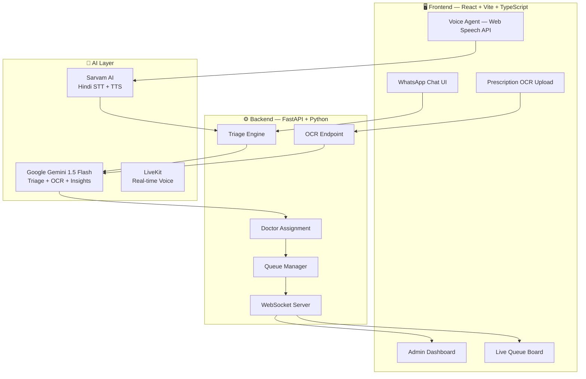

[

]()
[

]()
[

]()
[

]()
[

]()
[

]()
[

]()
[

]()

# 🏥 Saarthi AI
## Intelligent OPD Triage & Queue Management for KGMU Lucknow
### AI-Powered Patient Triage Agent | Team Syntrix | APL 2025

> "5,000 patients walk into KGMU every day. 
>  Saarthi AI ensures the most critical ones 
>  are never lost in the queue."

## 1. Problem Statement
- KGMU handles 5000+ OPD patients daily
- No intelligent prioritization system
- Critical cardiac patients wait with minor cases
- Manual triage = slow, error-prone, life-threatening
- Lucknow Civil Hospital faces same challenge

## 2. Solution Overview
- Saarthi AI: WhatsApp-style pre-triage chatbot
- Gemini AI classifies symptoms in real-time
- Critical cases → Emergency in 0-3 minutes
- Real-time admin dashboard for hospital staff
- Voice triage in Hindi + 8 Indian languages
- Prescription OCR — upload photo, get triaged

## 3. Demo Video
[📹 Watch Demo](YOUR_LINK_HERE)

## 4. Key Features
- 🚨 **Emergency Escalation** — Critical cases bypass queue instantly
- 🤖 **Gemini AI Triage** — Symptom analysis in seconds  
- 🎙️ **Hindi Voice Agent** — Speak symptoms, get routed
- 📋 **Prescription OCR** — Upload prescription photo for auto-triage
- 📊 **Live Admin Dashboard** — Real-time queue war room
- ⚡ **WebSocket Updates** — Queue changes appear instantly
- 🖨️ **Token Slip** — Printable OPD token with doctor + room
- 🏥 **KGMU Specific** — 8 departments, 24 doctors, real room numbers

## 5. Agent Workflow
**5 AI Agents Working Together**



## 6. System Architecture



## 7. Tech Stack
| Component | Technology |
|---|---|
| Frontend | React, TypeScript, Vite, Tailwind CSS |
| Backend | FastAPI, Python, WebSockets |
| Primary AI | Google Gemini 1.5 Flash |
| Voice STT/TTS | Sarvam AI (bulbul:v1, saaras:v1) |
| Voice Infrastructure | LiveKit WebRTC |
| Charts | Recharts |
| Real-time | WebSockets |
| OCR | Gemini Vision API |

## 8. Setup & Run

### Backend
```bash
cd backend
python -m venv venv
source venv/bin/activate  # On Windows use `venv\Scripts\activate`
pip install -r requirements.txt
# Set environment variables in .env (GEMINI_API_KEY, SARVAM_API_KEY, LIVEKIT_*)
uvicorn main:app --reload --port 8000
```

### Frontend
```bash
npm install
npm run dev
```

### Voice Agent Setup
Ensure backend is running (provides LiveKit token and Sarvam STT/TTS).
Go to `http://localhost:5173/voice-agent` to test the voice capabilities.

## 9. API Reference
| Endpoint | Method | Description |
|---|---|---|
| `/api/triage` | POST | Gemini triage |
| `/api/ocr-triage` | POST | Prescription image triage |
| `/api/queue` | GET | All patients |
| `/api/queue/add` | POST | Add patient |
| `/api/departments` | GET | Department list |
| `/api/stats` | GET | Hospital stats |
| `/api/insights` | GET | AI insights |
| `/api/livekit/token` | GET | Voice room token |
| `/ws/queue` | WS | Real-time updates |

## 10. Demo Scenarios

**🚨 Critical:**
- **Input:** "Mere seene mein tej dard hai"
- **Output:** EMG token, Emergency Bay, 0-3 min

**⚠️ Moderate:**
- **Input:** "5 din se bukhar hai"
- **Output:** OPD token, General Medicine, ~28 min

**📋 OCR:**
- **Input:** Prescription photo upload
- **Output:** Auto-extracted symptoms, triage result

## 11. Impact
- Automated critical case detection with priority escalation
- Significant reduction in triage time for time-sensitive cases
- Designed to scale with KGMU infrastructure
- Multilingual support for UP patient population

## 12. Roadmap
- [ ] Real WhatsApp Business API Integration
- [ ] EHR / Hospital Management System Integration
- [ ] ML-based wait time prediction from historical data
- [ ] Automated SMS/WhatsApp notifications
- [ ] Expansion to Lucknow Civil Hospital
- [ ] Offline mode for low-connectivity areas

## 13. Team
**Team Syntrix | APL 2025 | Google Developer Groups Lucknow**
