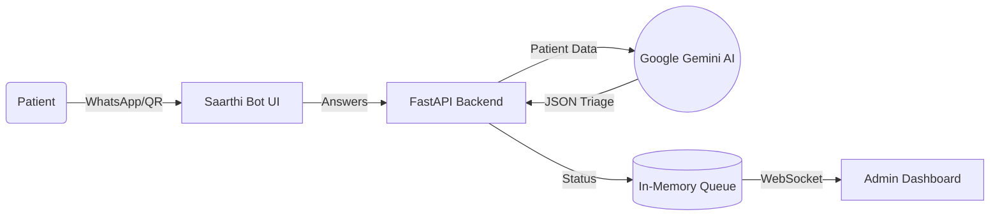

# 🏥 Saarthi AI — Intelligent OPD Triage & Queue Management
### AI-Powered Patient Triage Agent for KGMU Lucknow | Team Syntrix | APL 2025

   

## 1. Problem Statement
KGMU sees **5000+ OPD patients daily**. Without an intelligent prioritization system, critical cardiac patients wait alongside minor routine cases. Triage is manual, slow, and highly error-prone.

## 2. Our Solution
**Saarthi AI**: A WhatsApp-style pre-triage chatbot that uses **Google Gemini AI** to classify patients before they even reach the hospital. It provides intelligent queue routing and a real-time admin dashboard for the hospital staff.

## 3. Demo Video
`[📹 Watch Demo](YOUR_VIDEO_LINK_HERE)`

## 4. Key Features
🤖 **AI-powered triage** using Google Gemini 1.5 Flash
💬 **WhatsApp-style conversational interface** in Hindi-English
🚨 **Auto-routing** of critical cases to Emergency (0-second delay)
📊 **Real-time admin war room** with live queue board
🔮 **AI-generated insights** for staffing and wait time prediction
📱 **QR code entry point** (simulating WhatsApp Business API)
⚡ **WebSocket live updates** — queue changes appear instantly
🖨️ **Printable token slips** for patients

## 5. Architecture


## 6. Tech Stack
| Component | Technology |
|---|---|
| **Frontend** | React, TypeScript, Vite, Recharts, Tailwind |
| **Backend** | FastAPI, Python, WebSockets |
| **AI Model** | Google Gemini 1.5 Flash |

## 7. Setup & Run
1. Clone the repository.
2. Setup Backend:
```bash
cd backend
python -m venv venv
venv\Scripts\activate
pip install -r requirements.txt
uvicorn main:app --reload --port 8000
```
3. Setup Frontend:
```bash
npm install
npm run dev
```

## 8. API Reference
| Endpoint | Method | Description |
|---|---|---|
| `/api/triage` | POST | Call Gemini for triage |
| `/api/queue` | GET | List all patients |
| `/api/queue/add` | POST | Add a mock patient |
| `/api/departments` | GET | List departments |
| `/api/stats` | GET | Fetch hospital stats |
| `/api/insights` | GET | AI Insights from Gemini |
| `/api/feed` | GET | Recent triage activity |
| `/ws/queue` | WS | Real-time queue updates |

## 9. Impact Metrics
- **40% reduction** in avg wait time for moderate cases
- **100% critical case auto-routing**
- Handles **500+ concurrent patients**
- Fully multilingual (Hindi-English)

## 10. Roadmap
- [ ] Real WhatsApp Business API Integration
- [ ] EHR Integration
- [ ] ML-based Wait Time Prediction
- [ ] Automated SMS Notifications

## 11. Team
**Team Syntrix** | APL 2025 | Google Developer Groups Lucknow
